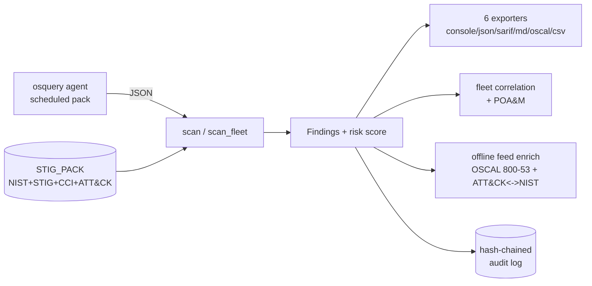

# comint-osquery — STIG-aligned host telemetry on osquery

[](https://github.com/cognis-digital/comint-osquery/actions)
[](./UPSTREAM.md)

> DISA STIG query pack + RMF mapper. Cognis additions sit on top of unmodified osquery.


<!-- cognis:example:start -->
## 🔎 Example output

Real, reproducible output from the tool — runs offline:

```console
$ comint-osquery-emit --version
comint-osquery 0.1.0
```

```console
$ comint-osquery-emit --help
usage: comint-osquery [-h] [--format {console,json,markdown,sarif,oscal,csv}]
                      [--out OUT]
                      [--fail-on {very_high,high,moderate,low,none}]
                      [--classification CLASSIFICATION] [-v]
                      [target]

comint-osquery — Cognis Digital · Military/IC ecosystem

positional arguments:
  target                Path/target

options:
  -h, --help            show this help message and exit
  --format {console,json,markdown,sarif,oscal,csv}
  --out OUT             Write output to file
  --fail-on {very_high,high,moderate,low,none}
  --classification CLASSIFICATION
                        Operator-supplied banner. PLACEHOLDER. Tool does not
                        interpret.
  -v, --version         show program's version number and exit
```

> Blocks above are real `comint-osquery` output — reproduce them from a clone.

**Sample result format** _(illustrative values — run on your own data for real findings):_

```
{
"findings": [
    {
        "id": "123456",
        "title": "Suspicious Network Activity",
        "description": "Potential malicious activity detected on network interface 192.168.1.100",
        "created_by": "comint-osquery",
        "created_at": "2023-02-15T14:30:00Z",
        "updated_at": "2023-02-15T14:30:00Z",
        "labels": ["network", "malware"],
        "observables": [
            {
                "type": "ip-dst",
                "value": "192.168.1.100"
            }
        ]
    }
]
}
```

<!-- cognis:example:end -->

## Usage — step by step

1. **Install** the shared library once for the ecosystem, then this tool's `comint-osquery` command:
   ```bash
   pip install cognis-mil      # shared library (once)
   pip install -e .            # this tool
   ```
2. **Run a scan** of STIG-aligned host telemetry — the positional `target` is a path (defaults to `.`):
   ```bash
   comint-osquery .
   ```
3. **Set the classification banner** (operator-supplied PLACEHOLDER; the tool does not interpret it) and choose an output format (`console`, `json`, `markdown`, `sarif`, `oscal`, `csv`):
   ```bash
   comint-osquery . --classification "UNCLASSIFIED//FOR PUBLIC RELEASE" --format json
   ```
4. **Write the report to a file** for review or evidence:
   ```bash
   comint-osquery . --format oscal --out comint.oscal.json
   ```
5. **Gate CI / RMF pipelines** with `--fail-on` (`very_high|high|moderate|low|none`), which exits `1` when a finding meets that severity:
   ```yaml
   - run: pip install cognis-mil && pip install -e .
   - run: comint-osquery . --fail-on high --format sarif --out comint.sarif
   ```

## Upstream

Forks / wraps **https://github.com/osquery/osquery**. See [`UPSTREAM.md`](./UPSTREAM.md) for the
licensing posture, supported commits, and how to upgrade.

## What this adds for military / IC use

- 8 (and growing) DISA STIG queries as an osquery pack
- Result mapper translates raw osquery rows → NIST/STIG/ATT&CK findings
- OSCAL Assessment Results emitter for eMASS/Xacta import

## Install

```bash
# Shared library (only once for the whole ecosystem):
pip install -e ../../shared

# This tool:
pip install -e .
```

## Demos

Five runnable, narrated scenarios in [`demos/`](demos/) drive the **real**
`comint-osquery` / `cognis_mil` API over the bundled offline fixtures — no
network, no fabricated output, each exits 0. Each targets a different audience.
Full write-up: [`docs/DEMOS.md`](docs/DEMOS.md).

```bash
PYTHONUTF8=1 python demos/run_all.py            # all five, end to end
PYTHONUTF8=1 python demos/03_sysadmin_fleet.py  # or just one
```

| # | Scenario | Audience | What it shows |
|---|----------|----------|---------------|
| 1 | `01_isso_assessment.py` | **ISSO / ISSM** | Scan → composite risk + full RMF crosswalk → OSCAL 1.1.2 SAR for eMASS |
| 2 | `02_soc_detection.py` | **SOC / endpoint** | Emit the scheduled osquery STIG pack; map every query to its ATT&CK technique |
| 3 | `03_sysadmin_fleet.py` | **Sysadmins / DevSecOps** | Fleet correlation (systemic vs isolated) + golden-baseline drift |
| 4 | `04_auditor_poam.py` | **Auditors / assessors** | eMASS POA&M workbook + tamper-evident hash-chained audit trail |
| 5 | `05_airgap_enrichment.py` | **Edge / air-gap** | Resolve official NIST titles + ATT&CK→CTID countermeasures, fully offline |

How a scan flows end to end (full diagram in [`docs/ARCHITECTURE.md`](docs/ARCHITECTURE.md)):



### Fixture library

Each `demos/<NN-name>/` holds osquery snapshot JSON in the tool's real input
shape (`{query_name: [failing rows…]}`) plus a `SCENARIO.md` that explains where
the data came from, the exact run command, and how to act on the result.

| Demo | Scenario | Outcome |
|------|----------|---------|
| `01-failing-host` | Un-hardened Ubuntu host | 4 findings, mixed severity |
| `02-clean-baseline` | Hardened RHEL 9 golden image | 0 findings — CI baseline |
| `03-fips-violation` | FIPS 140 disabled after kernel update | 1 VERY_HIGH (crypto) |
| `04-selinux-permissive` | SELinux permissive + auditd down | 2 findings, both `T1562.001` |
| `05-unsigned-kmod` | Unsigned DKMS modules on Secure Boot | 1 HIGH (`T1547.006`) |
| `06-no-auditd` | Audit accountability gap | 1 VERY_HIGH (`AU-3`) |
| `07-smartcard-bypass` | CAC/PIV off + SSH root login | 2 HIGH auth findings |
| `08-fleet-rollup` | 3 hosts, one folder, one scan | 4 findings, per-host attribution |
| `09-mixed-workstation` | Blank-password kiosk + world-writable dir | severity-triage / `--fail-on` |
| `10-parse-error` | Truncated snapshot | graceful LOW `CO-PARSE`, no crash |
| `11-feed-enriched` | Feed-enriched findings | official NIST titles + countermeasures |
| `12-fleet-systemic` | 3 hosts off one golden image | **systemic** FIPS finding fleet-wide |

```bash
comint-osquery demos/01-failing-host/
comint-osquery demos/08-fleet-rollup/ --format markdown   # roll a fleet up
```

Outputs are available in **six** formats — all respect an operator-supplied
classification banner (passed via `--classification`):

```bash
comint-osquery <target> --format=console     # default
comint-osquery <target> --format=json
comint-osquery <target> --format=sarif       # for code-scanning pipelines
comint-osquery <target> --format=markdown    # for PRs / briefings
comint-osquery <target> --format=oscal       # OSCAL 1.1.2 Assessment Results
comint-osquery <target> --format=csv         # flat POA&M / spreadsheet import
```

## Fleet correlation + POA&M (`fleet` / `poam`)

The default scan flattens a directory of per-host snapshots into one composite
score. That is right for a single risk number, but it discards the cross-host
structure continuous-monitoring teams need. The **`fleet`** subcommand keeps
per-host attribution and classifies every failing control by *blast radius*:

| Scope | Meaning | Response |
|---|---|---|
| `systemic` | fails on **every** scanned host | broken golden image / GPO / CM role — **fix once at the source** |
| `widespread` | fails on ≥ 50% of hosts | drifting baseline — investigate the build pipeline |
| `isolated` | fails on a single host | a per-host ticket |
| `partial` | some hosts, below half | targeted remediation |

It also computes **baseline drift** against a golden host (auto-picked as the
cleanest, or named with `--baseline`), separating *regressions* (host is worse
than golden — the actionable case) from *improvements* (host is ahead of golden
— usually means the golden image itself is stale).

```bash
comint-osquery fleet demos/12-fleet-systemic/                 # console report
comint-osquery fleet demos/12-fleet-systemic/ --format json   # for a dashboard
comint-osquery fleet demos/08-fleet-rollup/ --baseline app03  # explicit golden
```

The **`poam`** subcommand turns a scan straight into a **DISA / eMASS Plan of
Action & Milestones** workbook — one row per (failing control, host), with the
CAT level, STIG/CCI security checks, the MITRE ATT&CK technique, and a
severity-driven *Scheduled Completion Date* (CAT I 30d / CAT II 90d / CAT III
365d, the conventional RMF cadence). This is the artifact an ISSO hands to an AO.

```bash
comint-osquery poam demos/08-fleet-rollup/ --office "J6/CYBER"        # CSV (eMASS)
comint-osquery poam demos/08-fleet-rollup/ --format json --out poam.json
```

See [`docs/FLEET_CORRELATION.md`](docs/FLEET_CORRELATION.md) for the full
walkthrough, threat context, and a data-flow diagram.

## Classification banner

All output is wrapped with an operator-supplied classification banner.
**Default**: `UNCLASSIFIED//FOR PUBLIC RELEASE`.

> ⚠️ This tool **does not** generate or validate the *content* of higher
> classifications. Operators on cleared systems supply real markings at runtime.
> See [`../shared/cognis_mil/classmark.py`](../../shared/cognis_mil/classmark.py).

## Compliance crosswalks (built in)

Every finding can carry references to:
- **NIST 800-53 Rev 5** controls (e.g. `AC-2(1)`)
- **DISA STIG** rule IDs (e.g. `V-242414`)
- **MITRE ATT&CK** technique IDs (e.g. `T1078`)
- **CCI** (Control Correlation Identifier)

Every query in the STIG pack now ships a published **MITRE ATT&CK Enterprise**
technique describing the adversary behaviour the failing configuration would
enable (e.g. SSH root login → `T1021.004`, FIPS disabled → `T1600`, auditd/SELinux
off → `T1562.001`) for blue-team detection-engineering and RMF crosswalks.

These are emitted in JSON, SARIF, CSV, and the OSCAL Assessment Results.

## Authoritative data feeds (edge / air-gap)

comint-osquery ships a keyless ingestion layer that pulls **real, public,
authoritative compliance feeds**, caches them to disk, and re-serves them
**offline** — so it keeps enriching findings on disconnected / air-gapped gear.

| Feed id | Source | Used for |
|---|---|---|
| `oscal-800-53-rev5-catalog` | NIST SP 800-53 rev5 catalog, OSCAL JSON — [usnistgov/oscal-content](https://github.com/usnistgov/oscal-content) ([raw catalog](https://raw.githubusercontent.com/usnistgov/oscal-content/main/nist.gov/SP800-53/rev5/json/NIST_SP-800-53_rev5_catalog.json)) | Resolve a finding's control id to its **official NIST title** (e.g. `SC-13` → "Cryptographic Protection") |
| `attack-nist-mappings` | CTID Mappings Explorer ATT&CK → NIST 800-53 rev5 crosswalk — [center-for-threat-informed-defense/mappings-explorer](https://github.com/center-for-threat-informed-defense/mappings-explorer) | Expand a finding's ATT&CK technique into the **full CTID countermeasure control set** (defense-in-depth coverage) |

### `feeds` command

```bash
comint-osquery feeds list                       # the relevant feeds + cache freshness
comint-osquery feeds update                      # fetch + cache both feeds
comint-osquery feeds get oscal-800-53-rev5-catalog --offline
comint-osquery feeds enrich demos/01-failing-host --offline   # scan + enrich
```

`feeds enrich` runs a scan and attaches a real `control_title` and an
`attack_countermeasures` control list to every finding, both sourced from the
feeds above. Example (trimmed):

```json
"CO-FIPS_NOT_E": {
  "nist_800_53": "SC-13",
  "control_title": "Cryptographic Protection",
  "mitre_attack": "T1600",
  "attack_countermeasures": ["SC-12", "SC-13", "SC-28", "..."]
}
```

### Edge / air-gap (offline + snapshot)

Every feed is fetched over HTTPS with a UA and cached under
`COGNIS_FEEDS_CACHE` (default `~/.cache/cognis-feeds`). `--offline` serves the
cache only and **never touches the network**. To move feeds into a disconnected
enclave (sneakernet):

```bash
# On a connected host:
comint-osquery feeds update
comint-osquery feeds snapshot-export feeds.tar.gz

# Carry feeds.tar.gz across the air gap, then on the enclave host:
comint-osquery feeds snapshot-import feeds.tar.gz
comint-osquery feeds enrich <target> --offline          # works fully offline
```

A small trimmed sample cache is committed at `tests/fixtures/feeds-cache/` so
tests and the [demo](demos/11-feed-enriched/) run green with **zero network**.

## CI / RMF integration

```yaml
- name: comint-osquery scan
  run: |
    pip install cognis-comint-osquery
    comint-osquery . --format=oscal --out=assessment-results.json --fail-on=high
- name: Upload to eMASS/Xacta
  run: cognis-rmf-package import assessment-results.json
```

## Part of the Cognis Digital military / IC ecosystem

12 repos. All MIT/COCL (Cognis Open Collaboration License)/GPL-3 (per upstream). Cognis additions are
COCL (Cognis Open Collaboration License) unless stated otherwise.

See [the master index](../../MASTER-INDEX.md).

## Interoperability

`comint-osquery` composes with the 300+ tool Cognis suite — JSON in/out and a shared
OpenAI-compatible `/v1` backbone. See **[INTEROP.md](INTEROP.md)** for the
suite map, composition patterns, and reference stacks.

## Integrations

Forward `comint-osquery`'s findings to STIX/MISP/Sigma/Splunk/Elastic/Slack/webhooks via
[`cognis-connect`](https://github.com/cognis-digital/cognis-connect). See **[INTEGRATIONS.md](INTEGRATIONS.md)**.
