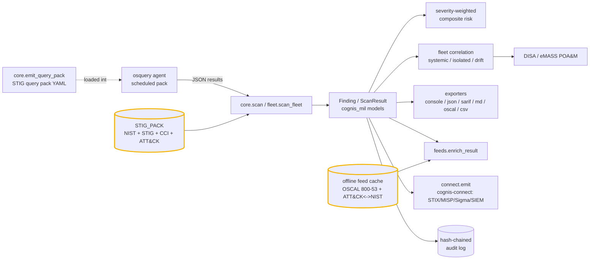
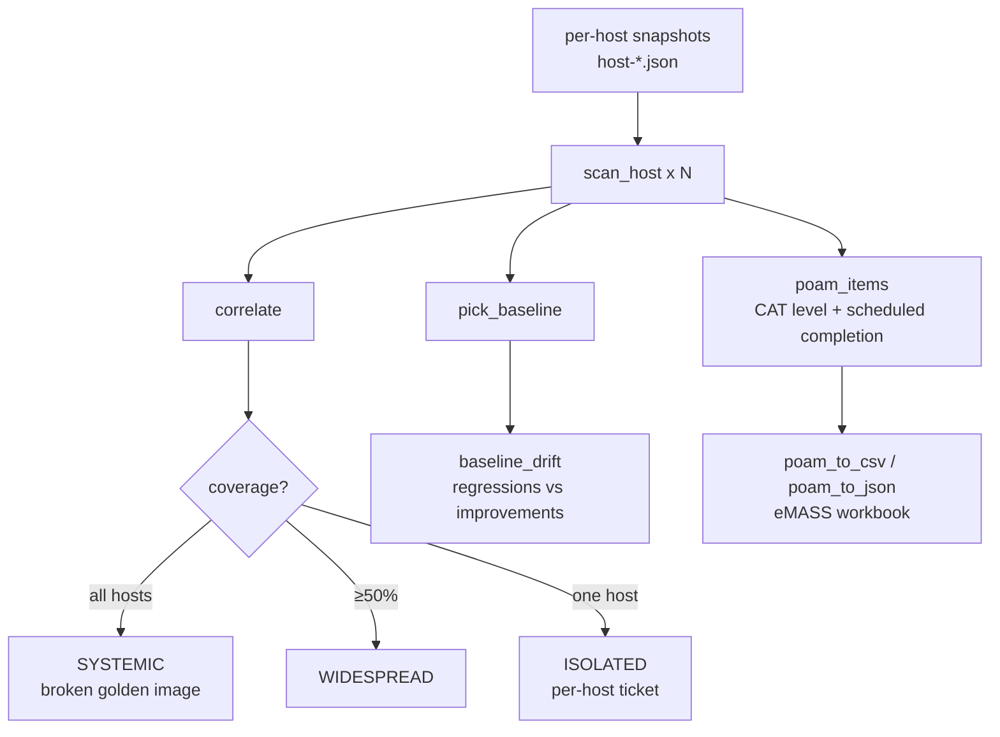

# Architecture

`comint-osquery` turns raw [osquery](https://osquery.io) host telemetry into a
DISA STIG-aligned, RMF-ready assessment. It is **Cognis additions only**:
upstream osquery (Apache-2.0) is installed separately and produces the JSON this
tool consumes. Everything here is pure standard library, deterministic, and
offline-capable.

## The pipeline

## Components

### STIG query pack (`comint_osquery/core.py` — `STIG_PACK`)
The heart of the tool: a table of STIG-aligned osquery checks. Each entry pairs
an osquery SQL query with the **real** compliance crosswalk for the *failing*
condition — its NIST SP 800-53 control, DISA STIG rule id (`V-…`), CCI, the
MITRE ATT&CK technique the weak config would enable, a severity, and a title.
`emit_query_pack()` renders this as a loadable osquery YAML pack; `scan()` reads
the query results back and maps the failing rows to findings.

### Scan + models (`core.scan`, `cognis_mil/models.py`)
`scan(target)` globs `*.json` osquery results under a directory (or a single
file), matches each query name against `STIG_PACK`, and emits a `Finding` per
failing check into a `ScanResult`. `finalize()` computes a severity-weighted
composite risk score (NIST 800-30 style, Very High → Very Low). Parse errors
degrade gracefully to a single LOW `CO-PARSE` finding rather than crashing.

### Fleet engine (`comint_osquery/fleet.py`)
The base scan *flattens* a directory of per-host snapshots into one score. The
fleet engine instead keeps **per-host attribution** and correlates failures
across the fleet, classifying each failing control by blast radius:

`pick_baseline` selects the cleanest host (or an explicit one); `baseline_drift`
reports per-host regressions (worse than golden — actionable) vs improvements
(golden is stale). `poam_items` emits one row per (failing control, host) with
the eMASS POA&M columns, CAT level derived from severity, and a
severity-driven scheduled-completion date (`REMEDIATION_DAYS`).

### Exporters (`cognis_mil/exporters.py`)
A `ScanResult` renders to six formats — `console`, `json`, `sarif` (code-scanning
pipelines), `markdown` (PRs / briefings), **OSCAL 1.1.2 Assessment Results**
(eMASS-ingestible, deterministic uuid5), and flat `csv` (POA&M / spreadsheet
import). All carry the operator-supplied classification banner.

### Data-feed layer (`comint_osquery/feeds.py`, `datafeeds.py`)
Resolves a finding's bare control id (`IA-5`) to its official NIST title
("Authenticator Management") from the **OSCAL 800-53 rev5** catalog, and expands
its single STIG-mapped ATT&CK technique into the full CTID-recommended
countermeasure control set (`attack-nist-mappings`). Feeds are fetched over
HTTPS, cached to disk, and re-served **offline** — `COGNIS_FEEDS_CACHE` plus
`snapshot_export`/`snapshot_import` give an air-gap sneakernet workflow.

### Audit log (`cognis_mil/audit.py`)
An append-only, hash-chained log: each entry's hash covers the previous hash, so
any later edit breaks the chain. `verify()` replays it and reports the first
break — making "what was assessed, and when" provable rather than asserted.

### Forwarding (`comint_osquery/connect.py`)
A soft-dependency bridge: maps findings to the canonical `Finding` contract and
forwards them via [`cognis-connect`](https://github.com/cognis-digital/cognis-connect)
to STIX/TAXII, MISP, Sigma, Splunk, Elastic, Slack/Discord, or a webhook.

## Why these choices

- **Standard library, offline-first.** No pip deps in the core path; the tool
  drops onto disconnected / edge / air-gapped gear and keeps working from a
  cached feed snapshot.
- **No fabricated identifiers.** Every control / STIG / CCI / ATT&CK id in
  `STIG_PACK` is a real, published identifier; feed enrichment pulls official
  titles from the NIST OSCAL catalog.
- **The artifact is the product.** An ISSO doesn't want a pretty console — they
  want an OSCAL SAR and an eMASS POA&M. The tool produces those directly from a
  scan.
- **Defensive / authorized-use only.** Compliance, RMF crosswalking, and
  continuous-monitoring situational awareness — not offense.
