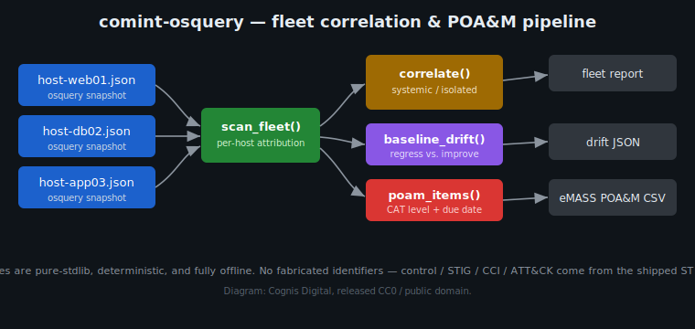

# Fleet correlation, baseline drift, and POA&M generation

> **UNCLASSIFIED//FOR PUBLIC RELEASE.** Defensive / authorized-use compliance
> and situational-awareness tooling only. This document is candid and technical
> because the subject — host hardening posture across a fleet — is a defensive
> security discipline.



*Diagram: Cognis Digital, released CC0 / public domain. No external assets.*

## Why this exists

`comint-osquery <dir>` globs every `*.json` osquery snapshot in a directory and
flattens it into a single `ScanResult` with one composite risk score. That is
the correct shape when you want a single number for a host or a gate
(`--fail-on high` in CI). It is the **wrong** shape for continuous monitoring of
a *fleet*, because flattening throws away three things an ISSO / blue team
actually needs:

1. **Per-host attribution that survives analysis.** The flat scan stuffs the
   source filename into each finding's `location` string, but nothing
   *correlates* across hosts.
2. **Blast radius.** "FIPS disabled" appearing once is a host ticket. "FIPS
   disabled" appearing on *every* host is a broken golden image — a completely
   different (and far cheaper) fix. The flat view can't tell them apart.
3. **Drift direction.** Knowing a host differs from a baseline is useless unless
   you know *which way*: a regression (host is weaker than golden) is a finding;
   an "improvement" (host is stronger than golden) usually means the golden
   image itself is stale and needs re-baking.

The `fleet` and `poam` subcommands add exactly these. Both are pure-stdlib,
deterministic, and offline; they reuse the same `STIG_PACK` the scanner uses, so
**every NIST / STIG / CCI / ATT&CK identifier in the output is a real, shipped
value — nothing is fabricated.**

## Walkthrough — a real continuous-monitoring cycle

A nightly osquery collector drops one JSON snapshot per host into a shared
directory. Suppose three edge nodes were all provisioned from the same golden
image that shipped with FIPS 140 mode off (this is `demos/12-fleet-systemic/`).

### 1. Correlate

```bash
$ comint-osquery fleet demos/12-fleet-systemic/
========================================================================
  UNCLASSIFIED//FOR PUBLIC RELEASE
========================================================================
  comint-osquery — FLEET CORRELATION REPORT
  Hosts: 3 scanned (0 clean, 3 failing, 0 errored)
  Failing controls across fleet: 3
------------------------------------------------------------------------
  SYSTEMIC (every host — likely broken golden image / GPO):
    [SYS] SC-13     FIPS 140 mode disabled  [3 hosts]
  ISOLATED (single host):
    [ISO] AC-6(2)   SSH root login permitted  -> edge01
    [ISO] AU-3      auditd not running  -> edge02
------------------------------------------------------------------------
  BASELINE DRIFT (baseline = edge03):
    [DRIFT-] edge01: regressions -> AC-6(2)
    [DRIFT-] edge02: regressions -> AU-3
========================================================================
```

The single most valuable line here is the `SYSTEMIC` classification of `SC-13`.
Three identical FIPS findings in a flat list look like three tickets. The fleet
view says: **fix the image once, and all three disappear on the next snapshot.**
The two isolated findings are genuine per-host work.

The scope thresholds are deliberate:

| Scope | Rule | What it tells you |
|---|---|---|
| `systemic` | fails on **all** scanned hosts (n > 1) | the *source* is broken (image / GPO / Ansible role) |
| `widespread` | coverage ≥ 50% | the baseline is drifting; check the build pipeline |
| `partial` | some hosts, < 50% | a cluster — common cause across a subset |
| `isolated` | exactly one host | a per-host ticket |

### 2. Drift against a chosen golden

By default the baseline is auto-picked as the cleanest scanned host. You can
name one explicitly when you have a designated golden:

```bash
comint-osquery fleet demos/08-fleet-rollup/ --baseline app03 --format json
```

`regressions` are controls the host fails that the baseline does **not** — the
actionable set. `improvements` are controls the baseline fails that the host
does not; counter-intuitively these are a signal that **your golden image is out
of date** relative to a field host that got hardened, and the image should be
re-baked.

### 3. Generate the POA&M

```bash
$ comint-osquery poam demos/08-fleet-rollup/ --office "J6/CYBER"
POA&M Item ID,Control Vulnerability Description,Security Control Number (NC/NA),...
db02-001,auditd not running (1 finding(s) on db02),AU-3,J6/CYBER,V-238201,...,2026-07-22,...,CAT I,db02,T1562.001
db02-002,FIPS 140 mode disabled (1 finding(s) on db02),SC-13,J6/CYBER,V-238298 / CCI-002450,...,2026-07-22,...,CAT I,db02,T1600
web01-003,World-writable file owned by root ...,AC-3,...,CAT II,web01,T1222.002
web01-004,SSH root login permitted ...,AC-6(2),...,CAT II,web01,T1021.004
```

One row per (failing control, host), in the abbreviated public eMASS POA&M
column set. Each row carries:

- the **DISA CAT level** derived from severity (VERY_HIGH → CAT I, HIGH/MODERATE
  → CAT II, LOW → CAT III),
- the **Security Checks** column populated with the STIG rule id and CCI,
- the **MITRE ATT&CK** technique the weak config would enable, and
- a **Scheduled Completion Date** offset from the assessment date by the
  conventional RMF remediation cadence (CAT I 30 days, CAT II 90, CAT III 365).

Item IDs are `host-NNN`, deterministic and stable across runs so a re-scan diffs
cleanly in version control or a tracker.

## Threat / defensive context (frank)

- **Systemic crypto failure (`SC-13` / ATT&CK `T1600`, Weaken Encryption).** A
  fleet-wide FIPS-off finding means none of those nodes are using validated
  cryptographic modules. On a network expected to be FIPS-enforcing this is
  often a *silent* downgrade: TLS still negotiates, SSH still connects, so
  nothing visibly breaks — which is exactly why a periodic osquery check that
  reads `/proc/sys/crypto/fips_enabled` matters. Treating it as systemic points
  remediation at the image, not at 200 individual hosts.
- **`auditd` down (`AU-3` / `T1562.001`, Impair Defenses).** An adversary's
  first move after access is frequently to blind the host. A host that reports
  `auditd not running` has *no* accountability record for whatever happens next.
  When this is isolated rather than systemic, prioritize it: an image ships
  auditd enabled, so a single host with it off is more likely tampering than
  misconfiguration.
- **SSH root login permitted (`AC-6(2)` / `T1021.004`).** Direct root over SSH
  destroys per-admin attribution and removes the `sudo` audit trail. Combined
  with a world-writable path under a webroot (as `web01` shows), it is a
  plausible web-shell-to-root path worth manual review, not just a checkbox.

The point of correlation is **triage economics**: the same raw finding can be a
one-line image fix or a per-host incident depending on its blast radius, and the
`fleet` view makes that distinction explicit instead of leaving it buried in a
flat list.

## Data integrity & boundaries

- **No fabricated intel.** Control ids, STIG rule numbers, CCIs, and ATT&CK
  technique ids are taken verbatim from the shipped `STIG_PACK`. Synthetic test
  fixtures are clearly synthetic (`host-x.json`, `garbage{`).
- **Detection / monitoring / early-warning only.** Nothing here performs, plans,
  or recommends offensive action. The ATT&CK references describe the adversary
  behaviour a weak configuration would *enable*, for blue-team
  detection-engineering and RMF crosswalk purposes.
- **Offline-first.** No stage in this module makes a network call; the feeds
  enrichment layer is separate and explicitly cache-served.

## API reference (`comint_osquery.fleet`)

| Function | Returns |
|---|---|
| `scan_host(path)` | `HostResult` for one snapshot (keeps `failing` counts) |
| `scan_fleet(target)` | `list[HostResult]`, sorted, for a dir or single file |
| `correlate(hosts)` | `{query: {scope, hosts, coverage, …pack metadata}}` |
| `fleet_summary(hosts)` | rolled-up posture incl. systemic/widespread/isolated buckets |
| `pick_baseline(hosts, baseline_host=None)` | a `HostResult` (cleanest, or named) |
| `baseline_drift(hosts, baseline)` | per-host `regressions` / `improvements` |
| `poam_items(hosts, office='', assessed_at=None)` | list of eMASS POA&M row dicts |
| `poam_to_csv(items)` / `poam_to_json(items)` | serialised POA&M |
| `render_fleet_report(hosts, drift=None, classification=…)` | console report string |
